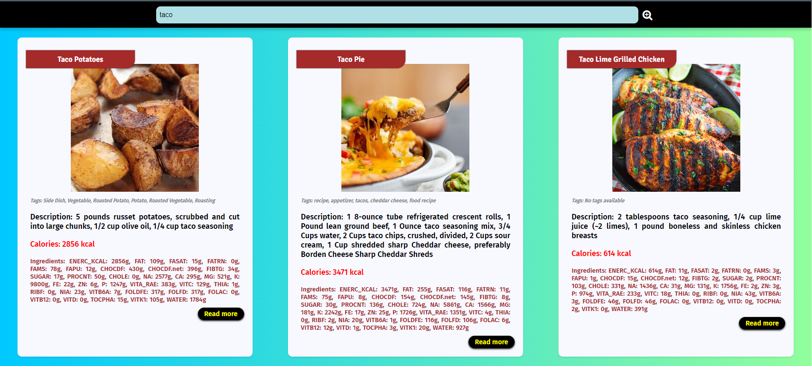
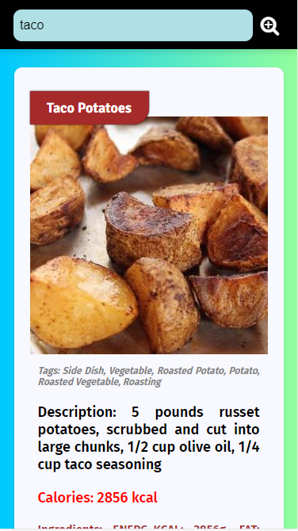

# Recipe Search

Recipe Search is a web application that allows users to search for recipes based on their query. It utilizes the Edamam API to fetch recipe data, including details such as ingredients, calories, and more.

## Usage
- Enter a recipe query (e.g., chicken, taco) in the search bar.
- Click the search button to retrieve recipes based on the entered query.
- Explore detailed information about each recipe, including tags, description, calories, and ingredients.

## Technologies Used
- HTML
- CSS
- JavaScript
- [Font Awesome](https://fontawesome.com/) for icons
- FREE Edamam API for recipe data

## Edamam API
This project utilizes the Edamam API for fetching recipe data. Edamam provides a comprehensive nutrition database and a powerful recipe search API that developers can use for free. To access the API, you need to sign up on the [Edamam Developer Portal](https://developer.edamam.com/) and obtain API keys.

## Screenshots
### Desktop View

### Mobile View

## Acknowledgments
- [Font Awesome](https://fontawesome.com/) for providing icons.
- Edamam for the recipe data API.

Feel free to contribute to the project by creating issues or submitting pull requests.

Happy cooking!
